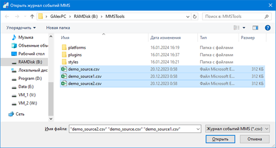
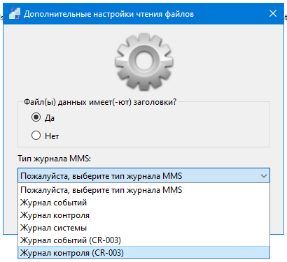
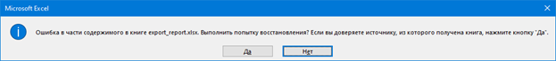

# Графическая утилита преобразования журналов событий Системы

## Аргументы командной строки

<table>
  <tr>
    <td>Аргумент</td>
    <td>ОС</td>
    <td>Описание</td>
  </tr>
  <tr>
    <th colspan="3">Выбор языка интерфейса утилиты</th>
  </tr>
  <tr>
    <td>Без аргумента</td>
    <td rowspan="3">Windows, Ubuntu</td>
    <td>При запуске загружается язык интерфейса утилиты, соответствующий языку интерфейса ОС. Если такого языка интерфейса утилиты нет, будет использован английский язык.</td>
  </tr>
  <tr>
    <td>--russian</td>
    <td>При запуске загружается русский язык интерфейса утилиты вне зависимости от языка интерфейса.</td>
  </tr>
  <tr>
    <td>--ukrainian</td>
    <td>При запуске загружается украинский язык интерфейса утилиты вне зависимости от языка интерфейса.</td>
  </tr>
  <tr>
    <th colspan="3">Переключение в многопользовательский режим*</th>
  </tr>
  <tr>
    <td>Без аргумента</td>
    <td rowspan="2">Windows</td>
    <td>При запуске утилита автоматически определяет режим работы.</td>
  </tr>
  <tr>
    <td>--enablerds</td>
    <td>Ручное включение многопользовательского режима.</td>
  </tr>
</table>

\* Режим работы утилиты отображается строке статуса окна утилиты:  
"Single mode" – однопользовательский режим;  
"RDP mode" – многопользовательский режим.

При запуске графической утилиты EventLogConverter.exe откроется основное окно программы:  

Для выбора *.csv файла(-ов) журналов событий Системы, необходимо нажать на кнопку “Выбрать файл(ы) журнала(-ов) событий”.  
Откроется стандартный диалог выбора файлов, где необходимо выбрать файл (файлы), по данным из которого (которых) будет построен отчет:  

При нажатии на кнопку “Открыть” выделенный файл(ы) будут выбраны для конвертации. После этого откроется окно, в котором необходимо указать наличие или отсутствие строки-заголовка с названием столбцов и выбрать необходимый тип журнала из списка доступных:  

Если файлы после выгрузки из Системы не изменялись, то они будут содержать заголовки и необходимо нажать на кнопку “Да”.  
После ответа на вопрос утилита выведет информацию о выбранных файлах, их типе и заголовках:  

**Примечание.** Если в файлах будут дубликаты записей (к примеру, из-за наложения диапазонов дат выборок), то утилиты отбросят дубликаты. Это особенно актуально для журналов аудита системы (Audit Tail и System log), т.к. временные метки до внедрения Запроса на Изменения № 3 имели точность до секунды и одинаковые события произошедшие в течении секунды, записались бы в базу как одно событие.  
Если все верно, то можно нажимать на кнопку “Конвертировать журнал событий”. Если необходимо добавить/удалить файл, то повторным нажатием кнопки “Выбрать файл(ы) журнала(-ов) событий” можно выбрать нужный файл (файлы), повторно ответить на вопрос о заголовках, типе журнала и перейти к их чтению и конвертации.  
Во время конвертации утилита выведет информацию о состоянии процесса чтения файлов и конвертирования данных из них. Если процесс прошел успешно, то в окне утилиты информация будет выглядеть как на примере:  

В случае ошибки будет выведено соответствующее сообщение и утилита прекратит чтение файлов и конвертацию данных.  
Если конвертация данных прошла успешно, то можно создавать отчет.  
Для создания отчета необходимо нажать кнопку "Создать отчет". При этом откроется окно "Дополнительные настройки фильтрации отчетов":  
 

В выпадающем списке "Тип отчета MMS" необходимо выбрать тип отчета в зависимости от типа загруженных данных.

Так как журнал событий и журнал аудита до Запроса на изменения № 3 содержат временные метки разной точности, то на секундном интервале могут быть неточности последовательности событий.

Поле "Имена пользователей, включенные в отчет" используется для ввода списка имен тех пользователей, которые должны быть в отчете.

Поле "Имена пользователей, исключаемые из отчета" используется для ввода списка имен пользователей, которые должны быть исключены из отчета.

Имена в списках должны разделяться знаками "," (запятая) или ";" (точка с запятой). Если в поле “Имена пользователей, включенные в отчет” введены данные, то содержимое поля “Имена пользователей, исключаемые из отчета” будет проигнорировано.

Если в какое-либо из полей внесены данные, то для их применения необходимо нажать кнопку "Применить".

<table>
  <tr>
    <td><b>Кейс использования дополнительных настроек фильтрации:</b> 
Условно, в Системе есть пользователи с логинами iivanov и iivanov1 и необходима информация по пользователю iivanov. 
В выгруженных из Системы журналах событий будет информация как о iivanov, так и о iivanov1. 
Отфильтровать информацию можно выбрав один из вариантов: 
- добавив iivanov в “Имена пользователей, включенные в отчет”; 
- добавив iivanov1 в “Имена пользователей, исключаемые из отчета”.
    </td>
  </tr>
</table>

После закрытия окна откроется окно сохранения отчета, в котором необходимо ввести путь и имя файла результирующего отчета:  
  

После нажатии кнопки “Сохранить” окно закроется и начнется процесс формирование отчета. При большом объёма данных возможно некоторое подвисание (сообщение “Не отвечает” в шапке окна) окна утилиты. В этом нет ничего страшного.

Информация о примененных фильтров и процессе формирования отчета отобразятся в приложении:  
  

В случае ошибки будет выведено соответствующее сообщение и утилита прекратит чтение файлов или формирование отчета.

При запуске утилита настроена на автоматическую очистку БД (см. Дополнительные настройки). Если во время работы с утилитой необходимо очистить БД (к примеру, между операциями создания отчетов, чтобы данные одного отчета не попали в другой), то для этого необходимо нажать кнопку “Очистить БД”.

## Дополнительные настройки

Дополнительные настройки находятся в файле EventLogConverter.ini (EventLogConverter.conf в Ubuntu).
Расположение файла настроек по умолчанию:  
<table>
  <tr>
    <td>ОС</td>
    <td>Режим</td>
    <td>Путь к файлу настроек</td>
  </tr>
  <tr>
    <td rowspan="2">Windows</td>
    <td>Single mode</td>
    <td>Файл находится в папке с исполняемым файлом утилиты</td>
  </tr>
  <tr>
    <td>RDP mode</td>
    <td>%AppData%/EventLogConverter/</td>
  </tr>
  <tr>
    <td>Ubuntu</td>
    <td>-</td>
    <td>$HOME/.config/EventLogConverter/</td>
  </tr>
</table>

### Разделы файлов настроек

#### Раздел [HISTORY]

**Необязательный.** Используется только в EventLogConverter.ini (EventLogConverter.conf в Ubuntu) графической версии утилиты.  
В переменной “last_dir” хранится путь к последней папке, где был сохранен отчет.

#### Раздел [SETTINGS]

**Обязательный.** Используется всеми версиями утилит.  
В переменной "db_file_name" хранится путь и имя используемой утилитой БД. По умолчанию имя файла БД совпадает с именем файла утилиты.  
Расположение файла БД по умолчанию:  
<table>
  <tr>
    <td>ОС</td>
    <td>Режим</td>
    <td>Путь к файлу БД</td>
  </tr>
  <tr>
    <td rowspan="2">Windows</td>
    <td>Single mode</td>
    <td>Файл находится в папке с исполняемым файлом утилиты</td>
  </tr>
  <tr>
    <td>RDP mode</td>
    <td>%AppData%/EventLogConverter/</td>
  </tr>
  <tr>
    <td>Ubuntu</td>
    <td>-</td>
    <td>$HOME/.local/share/EventLogConverter/</td>
  </tr>
</table>

В переменной "clear_on_startup" указан признак очистки БД при запуске утилиты:  
<table>
  <tr>
    <td>Значение переменной</td>
    <td>Описание</td>
  </tr>
  <tr>
    <td>yes</td>
    <td>очистка БД выполняется</td>
  </tr>
  <tr>
    <td>no</td>
    <td>очистка БД не выполняется</td>
  </tr>
</table>

В переменной "internal_ip_start_octet" указан признак (первый октет), по которому утилита различает внутренний IP-адрес.

В переменной "default_monitor" указывается, на каком мониторе будет открыто главное окно графической версии утилиты: 1 – 1-й монитор, 2 – 2-й монитор и т.д. По умолчанию значение 0 – автоматический выбор монитора утилитой.  
Значение переменной "default_monitor" имеет смысл только в ОС Windows для конфигураций с несколькими мониторами .

#### Раздел [DATABASE]

**Обязательный.** Используется всеми версиями утилит.
Данные параметры стоит менять с осторожностью (не стоит менять эти параметры без особой на то необходимости), в зависимости от суммарного объёма файлов журналов событий Системы и доступных ресурсов хоста (доступного объёма ОЗУ).
Рекомендуемые параметры (оптимальное быстродействие):  
<table>
  <tr>
    <td rowspan="2">Имя переменной</td>
    <th colspan="2">Значение переменных</th>
  </tr>
  <tr>
    <td>Суммарный размер файлов журналов до 250 МБ</td>
    <td>Суммарный размер файлов журналов более 250 МБ</td>
  </tr>
  <tr>
    <td>temp_store</td>
    <td>MEMORY</td>
    <td>DEFAULT</td>
  </tr>
  <tr>
    <td>journal_mode</td>
    <td>MEMORY</td>
    <td>OFF* </td>
  </tr>
  <tr>
    <td>synchronous</td>
    <td>NORMAL</td>
    <td>OFF* </td>
  </tr>
  <tr>
    <td>locking_mode</td>
    <td>EXCLUSIVE</td>
    <td>EXCLUSIVE</td>
  </tr>
</table>
* - unsafe mode

#### Раздел [REPORT]

В переменной “show_milliseconds” указан признак, по которому в результатах будет показываться значение локального времени включая миллисекунды. По умолчанию отображение миллисекунд отключено.

#### Раздел [BASIC_FILTER]

В переменной “allowed_chars” указана строка символов, которые разрешено использовать в логинах пользователей.

## Известные проблемы

### Ошибка в части содержимого

При открытии некоторых xlsx-файлов отчетов может появляться сообщение об ошибке:  
  
  
  

Аналогичное сообщение об ошибке может появляться при открытии xls-файлов выгрузок из Системы.

Ошибка проявляется в случае, когда в поле "Детали" события "Фінансова гарантія" находится более 32 767 символов. Это [ограничение](https://support.microsoft.com/en-us/office/excel-specifications-and-limits-1672b34d-7043-467e-8e27-269d656771c3) Microsoft Excel (в LibreOffice 24.2.0.3 и выше такого ограничения не наблюдается).

Утилиты во время формирования отчета проверяют кол-во символов в поле "Детали" и при превышении граничного значения пытаются уменьшить кол-во символов без ущерба для основных данных:  
<table>
  <tr>
    <td>Значение</td>
    <td>Аббревиатура</td>
  </tr>
  <tr>
    <td>VALIDATE_SCHEDULES</td>
    <td>V_S</td>
  </tr>
  <tr>
    <td>SEND_TO_DAM</td>
    <td>S_T_D</td>
  </tr>
</table>

Результирующая строка записывается в файл отчета (даже если количество символов в ней все равно превышает граничное значение).

### Ошибка парсера

При парсинге csv-файлов может появляться сообщение об ошибке:  
  
Это может быть как отдельным символом (как на скриншоте) или частью строки.  
Такая ошибка в большинстве случаев связана с изменением csv-файла – он мог быть открыт и случайно сохранен. При этом символ перевода строки из Unix (LF) формата конвертируется в Windows (CR LF) формат.  
Так же это может быть из-за неудачного ручного изменения файла.  
**Решение проблемы:** повторно выгрузить из Системы csv-файл с данными и повторить его чтение.
