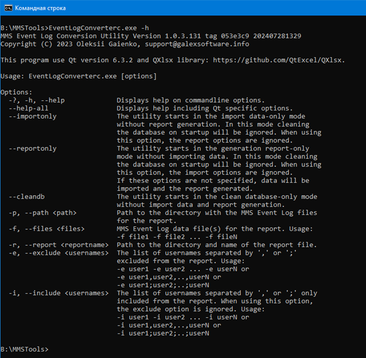

# Консольная утилита преобразования журналов событий Системы

## Аргументы командной строки

Консольная версия утилиты предназначена для выполнения без взаимодействия с пользователем.
При запуске консольной версии утилиты с аргументами -?, -h, --help на экран консоли будет выведена справка об утилите.

## Аргументы выбора режимов работы утилиты
  
| Режим работы | Аргумент | Описание |
|:-:|:-:|:-|
| Только чистка БД | --cleandb | В этом режиме утилита выполняет очистку БД и прекращает работу. Выбор и загрузка данных, формирование отчета не выполняется. Все остальные аргументы и их значения игнорируются, значение переменной “clear_on_startup” игнорируется. |
| Только импорт данных | --importonly | В этом режиме утилита выполняет только выбор и загрузку данных. Формирование отчета не выполняется. Утилита обрабатывает значения аргументов: "-p, --path" и "-f, --files". |
| Только формирование отчета | --reportonly | В этом режиме утилита выполняет только формирование отчета по ранее загруженным данным. В этом режиме рекомендуется явно указать путь и имя файла отчета. Утилита обрабатывает значения аргументов: "-r, --report", "-e, --exclude" и "-i, --include" |

**Примечание.** Если в файлах будут дубликаты записей (к примеру, из-за наложения диапазонов дат выборок), то утилиты отбросят дубликаты.
Для выполнения утилиты в обычном режиме (выбор и загрузка файлов, формирование отчета), вышеописанные аргументы не указываются.

## Аргументы для выбора и загрузки файлов журналов событий Системы

После “-p, --path” необходимо указать путь к папке, в которой утилита будет искать csv-файл(ы) EventLog для чтения. Также можно использовать маску для поиска:  
Значение аргумента -p (--path) B:\MMSTools\firm*.csv заставит утилиту найти все csv-файлы EventLog в папке B:\MMSTools, имя которых начинается на "firm".  
После “-f, --files” необходимо указать имена файлов и пути к ним.

## Аргумент для сохранения результатов:

После “-r, --report” необходимо указать имя файла и путь к нему. Если не указать этот аргумент, то в зависимости от режима работы:

| Режим работы | Действия утилиты |
|:-:|:-|
| Обычный режим | Утилита создаст файл со штампом времени в названии и сохранит в папке, где находятся исходные csv-файлы. |
| Только формирование отчета | Утилита создаст файл со штампом времени в названии и сохранит в папке с исполняемым файлом утилиты (в рабочую папку утилиты). |

## Дополнительные (необязательные) настройки фильтрации отчетов.

Использование данных настроек аналогично использованию настроек фильтрации в  графической версии утилиты.  
После “-e, --exclude” необходимо указать список имен пользователей, которые должны быть исключены из отчета.  
После “-i, --include” необходимо указать список имен пользователей, которые должны быть в отчете.  
Имена в списках должны разделяться знаками “,” (запятая) или “;” (точка с запятой). Если используется аргумент “-i, --include”, то аргумент “-e, --exclude” будет проигнорирован.

В случае ошибки будет выведено соответствующее сообщение и утилита прекратит чтение файлов или формирование отчета.

При запуске утилита настроена на автоматическую очистку БД (см. Дополнительные настройки). Если во время работы с утилитой необходимо очистить БД (к примеру, между операциями создания отчетов, чтобы данные одного отчета не попали в другой), то для этого необходимо нажать кнопку “Очистить БД”.

## Дополнительные настройки

Дополнительные настройки находятся в файле EventLogConverterc.ini. Файл находится в папке с исполняемым файлом утилиты.  
Все настройки полностью совпадают с настройками Графической утилиты преобразования журналов событий Системы.

## Известные проблемы

Так как консольная и графические версии утилит используют единую кодовую базу, все возмлжные проблемы полностью совпадают с проблемами, описанными в документу к Графической утилите преобразования журналов событий Системы.
