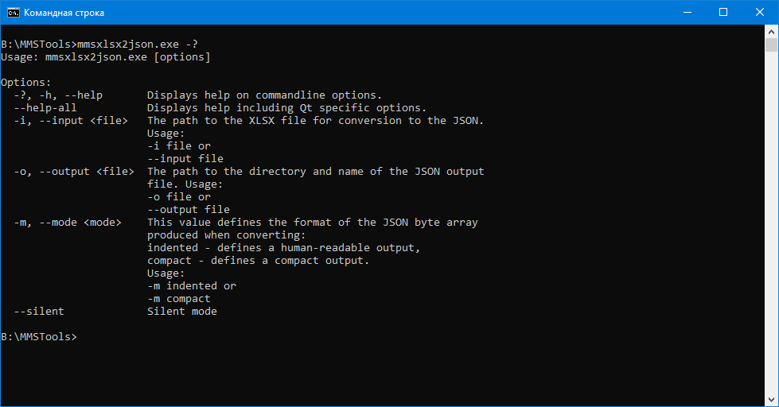

# Консольная утилита преобразования файлов CRM

## Аргументы командной строки

Консольная версия утилиты предназначена для выполнения без взаимодействия с пользователем. Утилита преобразовывает файлы полученными из CRM в формат, понятный Системе.  
При запуске консольной версии утилиты с аргументами -?, -h, --help на экран консоли будет выведена справка об утилите.

## Аргумент для выбора файлов и CRM журналов событий Системы

После “-i, --input” необходимо указать имя файла, полученного из CRM для последующего преобразования.

## Аргумент для сохранения результатов:

После “-o, --output” необходимо указать имя результирующего файла и путь к нему.

## Дополнительные (необязательные) настройки

После “-m, --mode” указывает на формат получаемого файла json:

| Режим работы | Действия утилиты |
|:-:|:-|
| intented | Определяет вывод, понятный человеку. |
| compact | Определяет компактный вывод. |

Флаг --silent отключает вывод на консоль незначительных сообщений утилиты.
